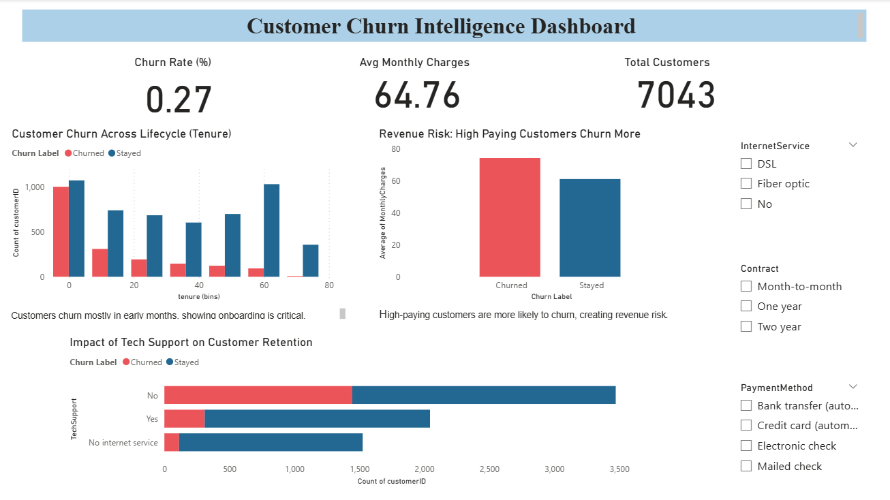

## 📊 Customer Churn Analysis Dashboard (Power BI + Python)
### 🎯 Project Objective

Customer churn is a major challenge for subscription-based businesses — losing customers directly impacts revenue.

This project analyzes churn patterns, identifies key drivers, predicts high-risk segments, and provides actionable recommendations to improve retention.

### 📈 Key Features
- KPI metrics (Churn rate, Revenue at risk, Support usage)
- Churn trend analysis by tenure, revenue, and support interactions
- High-risk customer segmentation
- Interactive Power BI filters for retention scenario analysis

### 🛠 Tools Used
- Python (Pandas, Seaborn)
- Power BI

### 📊 Insights
- High churn occurs in the first 0–12 months of the customer lifecycle
- High-paying customers are more likely to churn, representing revenue risk
- Customers without tech support show significantly higher churn rates

### 📁 Files Included
- Jupyter Notebook (.ipynb) – Analysis & visualizations
- Power BI Dashboard (.pbix) – Interactive dashboard
- Project Report (.pdf) – Summary of findings & recommendations
- Screenshot (.png) – Key dashboard view

### 📊 Dashboard Preview

### 📂 Dataset
The dataset used in this project is a simulated customer churn dataset for analysis and dashboard building.

⭐ Feel free to explore the files and give feedback!
